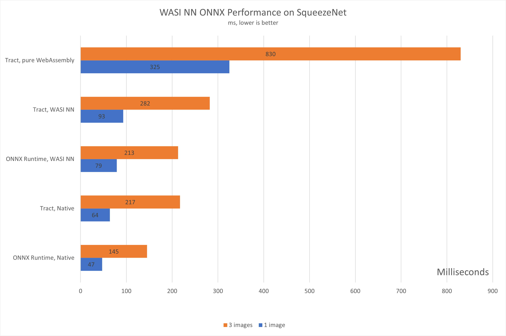
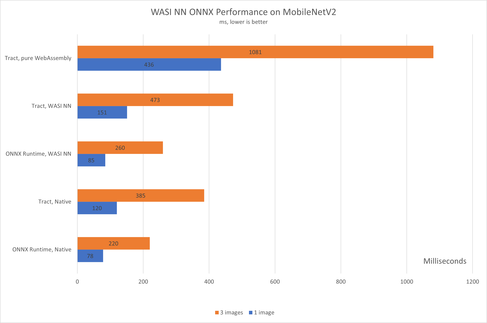

# ONNX implementation for WASI NN

This project is an experimental [ONNX][onnx] implementation for [the WASI NN
specification][wasi-nn], and it enables performing neural network inferences in
WASI runtimes at near-native performance for ONNX models by leveraging CPU
multi-threading or GPU usage on the runtime, and exporting this host
functionality to guest modules running in WebAssembly.

It follows the [WASI NN implementation from Wasmtime][wasmtime-impl], and adds
two new runtimes for performing inferences on ONNX models:

- one based on the [native ONNX runtime][msft], which uses [community-built Rust
  bindings][bindings] to the runtime's C API.
- one based on the [Tract crate][tract], which is a native inference engine for
  running ONNX models, written in Rust.

### How does this work?

WASI NN is a "graph loader" API. This means the guest WebAssembly module passes
the ONNX model as opaque bytes to the runtime, together with input tensors, the
runtime performs the inference, and the guest module can then retrieve the
output tensors. The WASI NN API is as follows:

- `load` a model using one or more opaque byte arrays
- `init_execution_context` and bind some tensors to it using `set_input`
- `compute` the ML inference using the bound context
- retrieve the inference result tensors using `get_output`

The two back-ends from this repository implement the API defined above using
each of the two runtimes mentioned. So why two implementations? The main reason
has to do with the performance vs. ease of configuration trade-off. More
specifically:

- the native ONNX runtime will provide the most performance, with multi-threaded
  CPU and access to the GPU. Additionally, any ONNX module should be fully
  compatible with this runtime (keeping in mind our current implementation
  limitations described below). However, setting it up requires that the ONNX
  shared libraries be downloaded and configured on the host.
- the Tract runtime is implemented purely in Rust, and does not need any shared
  libraries. However, it only passes _successfully about 85% of ONNX backend
  tests_, and it does not implement internal multi-threading or GPU access.

The following represents a _very simple_ benchmark of running two computer
vision models, [SqueezeNetV1][sq] and [MobileNetV2][mb], compiled natively, run
with WASI NN with both back-ends, and run purely on WebAssembly using Tract:





A few notes on the performance:

- this represents _very early_ data, on a limited number of runs and models, and
  should only be interpreted in terms of the relative performance difference we
  could expect between native, WASI NN and pure WebAssembly
- the ONNX runtime is running multi-threaded on the CPU _only_, as the GPU is
  not yet enabled
- in each case, all tests are executing the same ONNX model on the same images
- all WebAssembly modules (both those built with WASI NN and the ones running
  pure Wasm) are run with Wasmtime v0.28, with caching enabled
- as we test with more ONNX models, the data should be updated

### Current limitations

- only FP32 tensor types are currently supported
  ([#20](https://github.com/deislabs/wasi-nn-onnx/issues/20)) - this is the main
  limitation right now, and it has to do with the way we track state internally.
  This should not affect popular models (such as computer vision scenarios).
- GPU execution is not yet enabled in the native ONNX runtime
  ([#9](https://github.com/deislabs/wasi-nn-onnx/issues/9))
- only the Tract implementation currently executes on Windows
  ([#11](https://github.com/deislabs/wasi-nn-onnx/issues/11))

### Building, running, and writing WebAssembly modules that use WASI NN

The following are the build instructions for Linux. First, download
[the ONNX runtime 1.6 shared library](https://github.com/microsoft/onnxruntime/releases/tag/v1.6.0)
and unarchive it. Then, build the helper binary:

```
➜ cargo build --release --bin wasmtime-onnx
```

At this point, follow [the Rust example and test](./tests/rust/src/main.rs) to
build a WebAssembly module that uses this API, which uses the
[Rust client bindings for the API](https://github.com/bytecodealliance/wasi-nn).

Then, to run the example and test from this repository:

```
➜ LD_LIBRARY_PATH=<PATH-TO-ONNX>/onnx/onnxruntime-linux-x64-1.6.0/lib RUST_LOG=wasi_nn_onnx_wasmtime=info,wasmtime_onnx=info \
        ./target/release/wasmtime-onnx \
        tests/rust/target/wasm32-wasi/release/wasi-nn-rust.wasm \
        --cache cache.toml \
        --dir tests/testdata \
        --invoke batch_squeezenet
```

Or to run the same function using the Tract runtime:

```
➜ LD_LIBRARY_PATH=<PATH-TO-ONNX>/onnx/onnxruntime-linux-x64-1.6.0/lib RUST_LOG=wasi_nn_onnx_wasmtime=info,wasmtime_onnx=info \
      ./target/release/wasmtime-onnx \
      tests/rust/target/wasm32-wasi/release/wasi-nn-rust.wasm \
      --cache cache.toml \
      --dir tests/testdata \
      --invoke batch_squeezenet \
      --tract
```

### Contributing

We welcome any contribution that adheres to our code of conduct. This project is
experimental, and we are delighted you are interested in using or contributing
to it! Please have a look at
[the issue queue](https://github.com/deislabs/wasi-nn-onnx/issues) and either
comment on existing issues, or open new ones for bugs or questions. We are
particularly looking for help in fixing the current known limitations, so please
have a look at
[issues labeled with `help wanted`](https://github.com/deislabs/wasi-nn-onnx/issues?q=is%3Aissue+is%3Aopen+sort%3Aupdated-desc+label%3A%22help+wanted%22).

### Code of Conduct

This project has adopted the
[Microsoft Open Source Code of Conduct](https://opensource.microsoft.com/codeofconduct/).

For more information see the
[Code of Conduct FAQ](https://opensource.microsoft.com/codeofconduct/faq/) or
contact [opencode@microsoft.com](mailto:opencode@microsoft.com) with any
additional questions or comments.

[onnx]: https://onnx.ai/
[wasi-nn]: https://github.com/Webassembly/wasi-nn
[wasmtime-impl]:
  https://github.com/bytecodealliance/wasmtime/tree/main/crates/wasi-nn
[msft]: https://github.com/microsoft/onnxruntime
[bindings]: https://github.com/nbigaouette/onnxruntime-rs
[tract]: https://github.com/sonos/tract
[nn]: https://bytecodealliance.org/articles/using-wasi-nn-in-wasmtime
[intel-talk]: https://youtu.be/lz2I_4vvCuc
[sq]:
  https://github.com/onnx/models/tree/master/vision/classification/squeezenet
[mb]: https://github.com/onnx/models/tree/master/vision/classification/mobilenet
